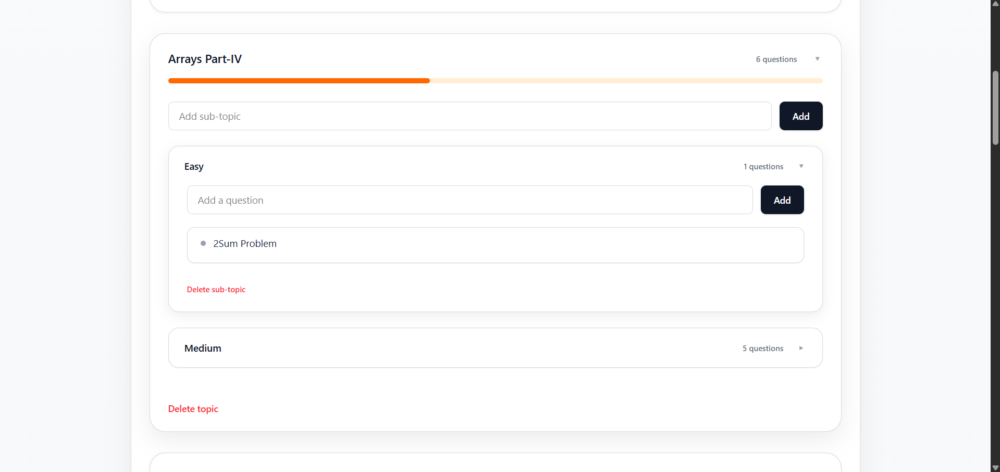

# Interactive Question Management Sheet

An interactive single-page web application for managing a hierarchical set of questions categorized by topics and sub-topics.  
This project is inspired by the question sheet experience on **Codolio** and focuses on clean UI, usability, and intuitive interactions.

##  Features

- Add, edit, and delete **topics**
- Add, edit, and delete **sub-topics** under topics
- Add, edit, and delete **questions** under sub-topics
- Drag and drop to reorder:
  - Topics
  - Sub-topics
  - Questions
- Collapsible topics and sub-topics for better readability
- Inline editing using double-click
- Clean, premium UI built with Tailwind CSS

---

## How to Use

1. Add a new topic using the input at the top of the page
2. Click on a topic to expand or collapse it
3. Add sub-topics under a topic
4. Add questions under specific sub-topics
5. Double-click on any topic, sub-topic, or question to edit it
6. Drag and drop items to reorder them as needed

---

## Screenshots

### Overview (Collapsed Topics)


### Expanded Topic View


---

## Tech Stack

- **React** – Frontend framework
- **Zustand** – State management
- **Tailwind CSS** – Styling and responsive UI
- **@hello-pangea/dnd** – Drag and drop functionality

---

##  Notes & Assumptions

- The application is implemented as a single-page web application.
- Data persistence is handled in-memory; no database is required for this assignment.
- The UI design is inspired by Codolio but implemented independently.
- The primary focus of this assignment is frontend functionality, state management, and user experience.


##  API Integration

Initial data is fetched from the following public API:

```bash
curl --location 'https://node.codolio.com/api/question-tracker/v1/sheet/public/get-sheet-by-slug/striver-sde-sheet'
```


